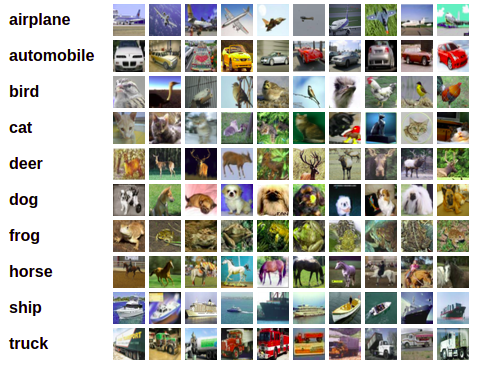

# Homework 10: Supervised Classification 

## Due: 3rd December, 2021 11:59pm ET

This homework asks you to fill in portions of code to classify an image dataset using a variety of classifiers, like the KNN, the SVM, and the MLP classifiers.

# Goals

In this assignment you will:
* Get familiar with dealing with image datasets.
* Learn the different stages of image classifications.
* Learn how to use some of the classifiers available in Python's sklearn package.

# Background

## Dataset
For this homework, we will be using the CIFAR-10 image dataset. Here is a brief description of this dataset from the official [website](https://www.cs.toronto.edu/~kriz/cifar.html):

"The CIFAR-10 dataset consists of 60000 32x32 colour images in 10 classes, with 6000 images per class. There are 50000 training images and 10000 test images.

The dataset is divided into five training batches and one test batch, each with 10000 images. The test batch contains exactly 1000 randomly-selected images from each class. The training batches contain the remaining images in random order, but some training batches may contain more images from one class than another. Between them, the training batches contain exactly 5000 images from each class.

Here are the classes in the dataset, as well as 10 random images from each:"



"The classes are completely mutually exclusive. There is no overlap between automobiles and trucks. "Automobile" includes sedans, SUVs, things of that sort. "Truck" includes only big trucks. Neither includes pickup trucks."

To save you some time in your experiments, we are restricting the dataset to
only 3 classes out of 10 which would result in having 15000 training images and
3000 testing images. We name this dataset as CIFAR-3 and the 3 classes will be:
* 0: airplane
* 1: automobile
* 2: bird
 
## K-Nearest Neighbor (KNN)

k-nearest neighbor (kNN) is a classifier that 
requires no assumptions about the data. It looks at the classes of the k-nearest points and 
picks the most frequent one.The choice of the value of k determines how representative your algorithm is. Please refer to the class notes for a more elaborate definition. You may want to look into [this documentation](https://scikit-learn.org/stable/modules/generated/sklearn.neighbors.KNeighborsClassifier.html) for the homework.

## Support-Vector Machine (SVM)

SVM is a supervised machine learning algorithm which strives to increase the maximum margin hyperplane separating the data classes while training. Please refer to the class notes for more details. You may want to look into [this documentation](https://scikit-learn.org/stable/modules/svm.html) to learn more about it's implementation.

## Multi-layer Perceptron (MLP)

MLPs are supervised classification techniques which involve layering of multiple perceptron unit. This helps in solving non-linear classification tasks as well as linear classification. Please refer to your class notes for more details. You may want to look into [this documentation](https://scikit-learn.org/stable/modules/generated/sklearn.neural_network.MLPClassifier.html) for your code.

# Instructions

## Packages
If you don't have the `scikit-learn` and `scikit-image` packages already installed in your
environment, you can use the following commands to install them:

```
python3 -mpip install --user scikit-learn
python3 -mpip install --user scikit-image
```

## Set up your repository for this homework.

Use the link on Piazza to set up Homework 10.

The repository should contain the following files:

1. This README.md.
2. `hw10_0.py` which contains a code for you to explore the dataset.
3. `hw10_1.py` which contains a skeleton code for KNN.
4. `hw10_2.py` which contains a skeleton code for SVM.
5. `hw10_3.py` which contains a skeleton code for MLP.
5. `load_cifar_10.py` a utility file to help you load the CIFAR-10 dataset.
6. `load-cifar-10` a folder that contains the CIFAR-10 dataset.

## Homework Problem 0: Exploring your dataset

In this task, we ask you to run the hw10_0.py file to visualize the CIFAR-3
dataset. By default, the code will display a 5x5 grid of random images. Explore
your dataset in this way and see what do the images look like. You can
increase/decrease the number of images displayed as you wish.

Note: you do not need to submit any output for this task. This is just for your own exploration.

## Homework Problem 1: The K-nearest-neighbor classifier

In hw10_1.py we provide a skeleton code for classifying the dataset using
the k-nearest-neighbor where k=5. Your task is to fill in the missing parts and classify the CIFAR-3 dataset using KNN for values of k
ranging from 1 to 5. For each value of k, print the accuracy and the confusion matrix. For example, for k=5 the accuracy and confusion matrix are:
```
Accuracy: 0.5493333333333333
[[716  12 272]
 [432 277 291]
 [331  14 655]]
```
Make sure to leave a blank line after each output for different values of k.


## Homework Problem 2: The Support-Vector Machine classifier

In hw10_2.py, we provide a skeleton code for classifying the CIFAR-3
dataset using the SVM classifier. Your task is to fill in the missing parts of
the code so that you can print the accuracy and the confusion matrix for SVM.

Note: ignore any warning message you might encounter about convergence.

## Homework Problem 3: The Multi-layer Perceptron classifier

In hw10_3.py, we provide a skeleton code for classifying the CIFAR-3
dataset using the MLP classifier. Your task is to fill in the missing parts of
the code so that you can print the accuracy and the confusion matrix for MLP.

How many neurons will you choose for the last hidden-layer? Put your answer in the code as directed in hw10_3.py.

Note: ignore any warning message you might encounter.

# Steps to submit your work

1. Save the output of `hw10_1.py` in a text file named `hw10_1.txt`
2. Save the output of `hw10_2.py` in a text file named `hw10_2.txt`
3. Save the output of `hw10_3.py` in a text file named `hw10_3.txt`
4. Delete the dataset folder `cifar-10-batches-py`
5. Push your modified versions of:
	* `hw10_1.py` and `hw10_1.txt`
	* `hw10_2.py` and `hw10_2.txt`
	* `hw10_3.py` and `hw10_3.txt`
